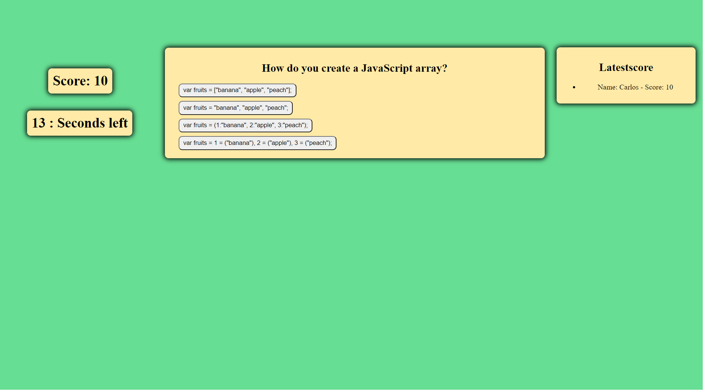

# JavaScript Quiz
This quiz consists of 5 timed questions that the user  will need to answer.

Users will have 60 seconds to finish the quiz. For every wrong answer 10 seconds will be subtracted from the timer.

At the end of the quiz users will be able to write their names to store it in a highscore board.

This quiz has been created with **HTML/CSS/JavaScript**.

---

## Website Screenshots

- This screenshot shows the main page.

- This screenshot shows one of the questions.

---

## Link to Deployed Application

https://grillogg.github.io/Code-Quiz/

